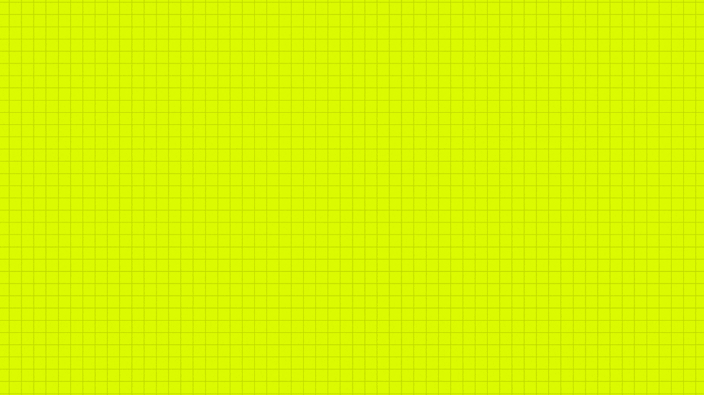

---
I'm a Frontend developer with a QA background, bringing testing experience to web development

➕ I'm passionate about creating and improving products that users truly enjoy  
➕ I'm focused on growing my technical skills and coding experience  
➕ I want to join a team where we build valuable products together  
➕ I'm actively job hunting now  

---

 
<!--<h3 align="center">➕ Code, commits & coffee: a day in the life of my GitHub</h3>-->

  

<!--<h3 align="center">➕ Repositories in action: coding, breaking and coding again!</h3>

 

-->

<!--<h3 align="center">➕ My сommit diary: the languages I speak (or attempt)</h3>

 

-->

<!--<h3 align="center">➕ Let’s Chat (or... just send a friendly dog's photo)</h3>-->

---

<!--<h3 align="center">➕ Techie Toolbox: the good, the bad and the compiled</h3>-->

  

---
<h3 align="center">➕ My current pet project Ramenator. Because what’s coding without a bowl of virtual noodles?</h3>

  

-------

### Links to my deployed projects. Feel free to interact with the frontend

🍜 <a href="https://noodle-and-bytes.vercel.app/" target="_blank">**RAMENATOR**</a>  

🛸 <a href="https://zero-gravity-steakhouse.vercel.app/" target="_blank">**ZERO GRAVITY STEAKHOUSE**</a>  

🌊 <a href="https://vibe-market.vercel.app/" target="_blank">**VIBE MARKET**</a>  

✨ <a href="https://we-need-to-do-it-perfectly-well.vercel.app/" target="_blank">**WE NEED TO DO IT PERFECTLY WELL**</a>   

💟 <a href="https://closing-tag.vercel.app/" target="_blank">**CLOSING TAG**</a> 

-------

<!--  -->

